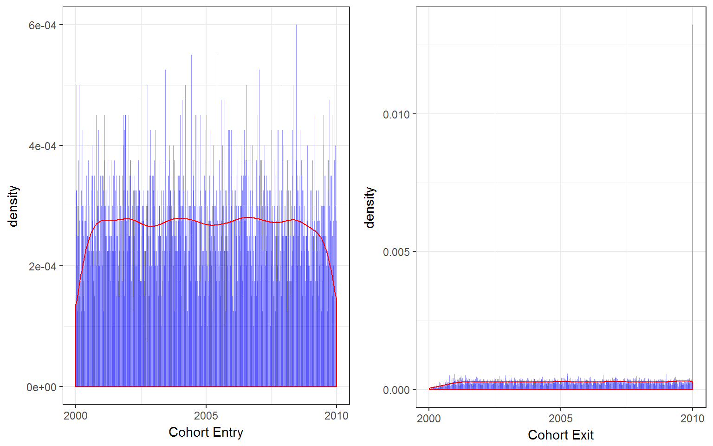

# Creating Longitudinal Datasets From Individual Records


## Introduction  

### Packages to use  

<!--html_preserve--><pre>
 R version 3.3.2 (2016-10-31)
 Platform: x86_64-w64-mingw32/x64 (64-bit)
 Running under: Windows 10 x64 (build 14393)
 
 attached base packages:
 [1] methods   stats     graphics  grDevices utils     datasets  base     
 
 other attached packages:
  [1] gridExtra_2.2.1   lubridate_1.6.0   knitr_1.15.17    
  [4] Scotty_0.0.0.9000 devtools_1.12.0   Hmisc_4.0-2      
  [7] Formula_1.2-1     survival_2.41-3   lattice_0.20-34  
 [10] dplyr_0.5.0       purrr_0.2.2       readr_1.1.0      
 [13] tidyr_0.6.1       tibble_1.3.0      ggplot2_2.2.1    
 [16] tidyverse_1.1.1  
 </pre>
<!--/html_preserve-->  

I often come across the following issue in my work:  

  Sometimes you are working with a dataset where each row is a nursing home assessment, admission record or some other per person observation. However, perhaps you are more interesting in analyzing group-level changes over time. In order to do this, you need to reshape and summarize these individual records into counts in a "panel" dataset. In this new dataset structure I want each row to be a unique time- group- summary of the data. Some extensions of this include computing incidence (no. events per 1000 persons) and incidence density (no. events per 1000 person-years) measures. I will go through some examples and show how these datasets and measures can be constructed from person or observation unit-level data, assuming you had cohort entry-dates (i.e. admission), event dates (the date of some thing you wish to quantify) and stop-dates (i.e. discharge).  

## Construct dataset  

First I will construct a test dataset to use in this chapter and subsequent ones.  

In this hypothetical I take a group of admissions that starts counting on 2000/01/01. Each entry will have a random exit up to 1000 days from entry, but censored at 2009/12/31 (because in my hypothetical example this is my study endpoint). Each entry will then have a random group classification (state), and event (0 or 1).  

The event will be assumed one per admission (E.g. death..). I didn't allow for multiple admissions by person. I then generate the event as drawn from a random bernoulli distribution with probability $p_g$ Where $g$ is a group-specific effect randomly generated from a uniform distribution between 0 and 0.3.       


```r
set.seed(12345) #So you get same result
sampsize = 20000
df <- data.frame(id=1:sampsize,
                 CohortEntry = sample(seq(as.Date('2000/01/01'), as.Date('2009/12/31'), by='day'), replace=T, sampsize))
#CohortIn, CohortOut, Group
df <- df %>%
    mutate(CohortExit = CohortEntry+sample(0:365,sampsize, replace=T)) %>% #CohortExit Date (up to 1000 days from start)
    mutate(State = factor(sample(state.name, sampsize, replace=T))) #Random state for each group
  df$CohortExit <- as.Date(sapply(df$CohortExit, function(x) X = min(x,as.Date('2009/12/31'))), origin=origin) #Censor at 'study end'

#Group Effect
  State <- as.data.frame(state.name)
  State$Effect <- runif(50, min=0, max=0.3) #Random effect by group

#Generate random event by group effect
  getReffect <- function(df, group) {
    p <- df[df$'state.name'==group,"Effect"]
    event = as.integer(rbernoulli(1, p = p))
    return(event)
  }
  
df$Event <- sapply(df$id, function(x) getReffect(State, df$State[x])) #Generate random event


#For more complicated procedures below, assign random event date between cohort start with event=0 to NA
  randomDate <- function(TimeIn, TimeOut, Event) {
    RDate <- sample(TimeIn:TimeOut, 1, replace=T)
    RDate <- ifelse(Event==0,NA,RDate)
    return(RDate)
  }
  
  df$EventDate = sapply(df$id, function(x) randomDate(df$CohortEntry[x], df$CohortExit[x], df$Event[x]))
  df$EventDate = as.Date(df$EventDate, origin=origin)
kable(head(df, n=10), align=c('c'))
```


 id    CohortEntry    CohortExit        State         Event    EventDate  
----  -------------  ------------  ----------------  -------  ------------
 1     2007-03-18     2007-10-10         Ohio           0          NA     
 2     2008-10-04     2009-10-04     Rhode Island       0          NA     
 3     2007-08-11     2008-04-24         Ohio           0          NA     
 4     2008-11-11     2009-10-26        Nevada          0          NA     
 5     2004-07-25     2004-08-29       New York         0          NA     
 6     2001-08-30     2002-05-29        Alaska          1      2002-03-23 
 7     2003-04-02     2004-02-23    North Carolina      0          NA     
 8     2005-02-03     2005-10-02        Maine           0          NA     
 9     2007-04-12     2007-06-09       Nebraska         0          NA     
 10    2009-11-24     2009-12-31        Maine           0          NA     

## Show Data  


```r
#Scatter and Fitted Line 
p1 <- ggplot(data=df, aes(x=CohortEntry)) + 
  geom_histogram(aes(y = ..density..), binwidth = 4, fill=I("blue"), alpha=I(0.4)) +
  geom_density(col=2) +
  xlab("Cohort Entry") +
  theme_bw()

p2 <- ggplot(data=df, aes(x=CohortExit)) + 
  geom_histogram(aes(y = ..density..), binwidth = 4, fill=I("blue"), alpha=I(0.4)) +
  geom_density(col=2) +
  xlab("Cohort Exit") +
  theme_bw()
grid.arrange(p1, p2, nrow=1)
```


  
  A simple, even distribution to work with (cohort exit is even except for censored at study end date).  

## Simple group counts  

If you simply seek to count the total no. of records by groups this is simple.  


```r
  dfState <- df %>%
    group_by(State) %>% #Tells dplyr to create grouped object, and then execute following at that unit
      summarise(Records = n()) #count individuals
  
  cat("Counts of Records by State")
```

```
## Counts of Records by State
```

```r
  kable(head(dfState, n=10), align=c('c'))
```

    State       Records 
-------------  ---------
   Alabama        396   
   Alaska         393   
   Arizona        393   
  Arkansas        385   
 California       372   
  Colorado        375   
 Connecticut      401   
  Delaware        399   
   Florida        376   
   Georgia        401   

Also, if you wish to see the quantity of some event, this is easy also:  

### Simple Event Counts  


```r
  dfState <- df %>%
    group_by(State) %>% #Tells dplyr to create grouped object, and then execute following at that unit
      summarise(Events = sum(Event)) #count no of events
  
  cat("Counts of Events by State")
```

```
## Counts of Events by State
```

```r
  kable(head(dfState, n=10), align=c('c'))
```

    State       Events 
-------------  --------
   Alabama        46   
   Alaska         26   
   Arizona        19   
  Arkansas        3    
 California       5    
  Colorado        84   
 Connecticut      61   
  Delaware       120   
   Florida       113   
   Georgia        59   

Note how the number of events is quite different by group, because we specified this above. If you wish to count records by time, this is still pretty easy, but you have to be more specific. For example, if I want to count the number of cohort entries by year, this is how:

## Cohort entries by year counts  


```r
#First make year var
df <- df %>%
  mutate(EntryYear = year(CohortEntry)) #year function from lubridate
  
#Second group by this var
dfGroup <- df %>% 
  group_by(EntryYear) %>%  
  summarise(Records = n(), Events = sum(Event)) #count individuals
  cat("Counts of Records by Cohort Entry Year")
```

```
## Counts of Records by Cohort Entry Year
```

```r
  kable(head(dfGroup, n=10), align=c('c'))
```


 EntryYear    Records    Events 
-----------  ---------  --------
   2000        2015       274   
   2001        1987       273   
   2002        2041       288   
   2003        1933       295   
   2004        2043       269   
   2005        2068       313   
   2006        1964       285   
   2007        2019       308   
   2008        1974       297   
   2009        1956       293   

Here you can see the number who enter the cohort by year, and among those how many events are observed.  

## Incidence

The next step will get a little trickier. Let's say we aren't interested in how many individuals entered/exited the cohort in a given year as above. Rather we want to identify how many patients are in the cohort during a specified period of time (e.g. year). This is the "population at risk". We wish to estimate the the number of events / population at risk. This is  [incidence](https://en.wikipedia.org/wiki/Incidence_(epidemiology)). So we need to take the "CohortEntry", "CohortExit" date variables and compute how many individuals were in the cohort in year 1, year 2 etc. What makes this tricky is that individuals don't start and stop at the same time and cross multiple time units (years in this case). 

Here is one method where I compute the no. of persons in the cohort in a given year, "incident" events and event rate:  


```r
  #Create New Dataframe by Time Unit
  TimeMin <- min(year(df$CohortEntry)) #lowest time unit observed
  TimeMax <- max(year(df$CohortExit)) #highest time unit observed
  
  #This following sequence step is good, in case a certain year was skipped 
  #(i.e. no admits that year)
  dfTime <- TimeMin:TimeMax %>% #Sequence years
    as_tibble() %>%
    mutate(x2 = NA, x3 = NA)
    names(dfTime) <- c("Year", "Residents", "Inc. Events")
    
  
  #Write a time-interval program for Residence (assuming x is year)
  InCohort <-  function(x, TimeIn, TimeOut) {
    #Note that the following line works because of R vectorization
    count <- if_else(x>=year(TimeIn) & x<=year(TimeOut),1,0) #Test if x is TimeIn<=x<=TimeOut
    InCohortN <- sum(count) #Add up total people
    return(InCohortN) #return
  }
  
  #Write a time-interval program for Event
  IncEvent <-  function(x, Event, EventDate) {
    #Note that the following line works because of R vectorization
    events <- if_else(Event==1 & x==year(EventDate),1,0) #Added condition of event==1
    InCohortEvents <- sum(events) #Add up total events in that year
    return(InCohortEvents) #return
  }
  dfTime$Residents <- sapply(dfTime$Year, function(x) InCohort(x, df$CohortEntry,df$CohortExit))
  dfTime$'Inc. Events' <- sapply(dfTime$Year, function(x) IncEvent(x, df$Event, df$EventDate))
  dfTime$'Event Rate' <- dfTime$'Inc. Events' / dfTime$Residents
  kable(head(dfTime, n=10), align=c('c'), digits=3)
```


 Year    Residents    Inc. Events    Event Rate 
------  -----------  -------------  ------------
 2000      2015           200          0.099    
 2001      2981           271          0.091    
 2002      3040           284          0.093    
 2003      2951           291          0.099    
 2004      3034           283          0.093    
 2005      3063           299          0.098    
 2006      2956           295          0.100    
 2007      2986           301          0.101    
 2008      2972           294          0.099    
 2009      2945           373          0.127    

I didn't specify a time-trend in my sample generation, and that is why the event rate is relatively constant over time.  

We can double-check this worked with the following specific code:  


```r
  #Logic
  # IF 2004 is less than or equal to EntryDate (i.e. they entered before or during 2004)
  # AND 2004 is less than or equal to Exit (i.e. they exited after or during 2004)
  Check <- ifelse(2004>=year(df$CohortEntry) & 2004<=year(df$CohortExit),1,0)
  cat("2004 people :", sum(Check))
```

```
## 2004 people : 3034
```

## Prevalence  

  The primary difference between incidence and prevalence is that incidence is only counting *new cases*. In order to compute prevalence, we need to identify individuals still in the cohort in a given year, but having the event in previous years as well.  
  
Here's how:  


```r
  #Code same as above
  TimeMin <- min(year(df$CohortEntry)) 
  TimeMax <- max(year(df$CohortExit)) 
  dfTime <- TimeMin:TimeMax %>% 
    as_tibble() %>%
    mutate(x2 = NA, x3 = NA)
    names(dfTime) <- c("Year", "Residents", "Prev. Events")
    
  InCohort <-  function(x, TimeIn, TimeOut) {
    count <- if_else(x>=year(TimeIn) & x<=year(TimeOut),1,0) 
    InCohortN <- sum(count) 
    return(InCohortN) 
  }
  
  #Write a time-interval program for Event
  PrevEvent <-  function(x, TimeIn, TimeOut, Event, EventDate) {
    #Key difference follows: 
    events <- if_else(x>=year(TimeIn) & x<=year(TimeOut) & Event==1 & x>=year(EventDate),1,0)
    InCohortEvents <- sum(events) #Add up total events in that year
    return(InCohortEvents) #return
  }
  
  dfTime$Residents <- sapply(dfTime$Year, function(x) InCohort(x, df$CohortEntry,df$CohortExit))
  dfTime$'Prev. Events' <- sapply(dfTime$Year, function(x) PrevEvent(x, df$CohortEntry, df$CohortExit, df$Event, df$EventDate))
  dfTime$'Prevalence Rate' <- dfTime$'Prev. Events' / dfTime$Residents
  kable(head(dfTime, n=10), align=c('c'), digits=3)
```


 Year    Residents    Prev. Events    Prevalence Rate 
------  -----------  --------------  -----------------
 2000      2015           200              0.099      
 2001      2981           339              0.114      
 2002      3040           352              0.116      
 2003      2951           360              0.122      
 2004      3034           360              0.119      
 2005      3063           358              0.117      
 2006      2956           381              0.129      
 2007      2986           356              0.119      
 2008      2972           372              0.125      
 2009      2945           436              0.148      

Note how the prevalence rate is higher, because you are counting events which happened in previous years. Also, the prevalence rate in the first year 2000 is the same as the incidence rate because we have no information before 2000 to add into the prevalent rate. If this is a problem in your empirical research, one approach would be to only count events from 2001 onward, and use the first year as a "lead-in" period.  

## Incidence Density  

The next goal is to report not the number of events per total population in a given time interval, but rather the number of events per person time. This is sometimes called [incidence density](https://en.wikipedia.org/wiki/Incidence_(epidemiology)), often reported as "x events per 100-person years". Conceptually you are saying you would on average expect x events in 1 person followed for 100 years, or x events in 100 persons followed for one year. This can be very useful when there is differing time accrued by the unit of observation (person, admission etc.). However, the relevance and interpretability of this measure is very specific to the thing being studied, i.e. it may not be a reasonable assumption that the event rate is constant over 100 years!  

The key new measure here is person-time, heres how to compute it:


```r
df <- df %>%
    mutate(PerTime = as.integer(CohortExit - CohortEntry)) #timeDiff
#Second group by this var
dfGroup <- df %>% 
  group_by(EntryYear) %>%  
  summarise(Records = n(), 'Days in Cohort' = sum(PerTime)) #count individuals
  kable(head(dfGroup, n=10), align=c('c'))
```


 EntryYear    Records    Days in Cohort 
-----------  ---------  ----------------
   2000        2015          366029     
   2001        1987          361894     
   2002        2041          366716     
   2003        1933          354578     
   2004        2043          366435     
   2005        2068          365334     
   2006        1964          355171     
   2007        2019          369771     
   2008        1974          364829     
   2009        1956          236663     

That was easy! person- or unit-time accrued is simply `CohortExit - CohortEntry`. However, note we are reporting person-time by the year individuals entered the cohort, not an actual interval of time. It gets more complicated if you want to report aggregated person-time by some time interval. Because our individuals cross years, some of their person time accrues to one or more years.  

Here is how to do this:  


```r
#Code same as above
  TimeMin <- min(year(df$CohortEntry)) 
  TimeMax <- max(year(df$CohortExit)) 
  dfTime <- TimeMin:TimeMax %>% 
    as_tibble() %>%
    mutate(x2 = NA, x3 = NA)
    names(dfTime) <- c('Year', 'Residents','Inc. Events')
    
  InCohort <-  function(x, TimeIn, TimeOut) {
    count <- if_else(x>=year(TimeIn) & x<=year(TimeOut),1,0) 
    InCohortN <- sum(count) 
    return(InCohortN) 
  }

  dfTime$Residents <- sapply(dfTime$Year, function(x) 
    InCohort(x, df$CohortEntry,df$CohortExit)) #Number of residents
  
  IncEvent <-  function(x, Event, EventDate) {
    #Note that the following line works because of R vectorization
    events <- if_else(Event==1 & x==year(EventDate),1,0) #Added condition of event==1
    InCohortEvents <- sum(events) #Add up total events in that year
    return(InCohortEvents) #return
  }
  
  dfTime$'Inc. Events' <- sapply(dfTime$Year, function(x) 
    IncEvent(x, df$Event, df$EventDate))

  #Function to compute person time
  TimeInCohort <- function(x, TimeIn, TimeOut) {
    
    #Key steps here:
    FirstDay <- as.Date(paste0('01/01/',x), format='%m/%d/%Y', origin=origin)
    LastDay <- as.Date(paste0('12/31/',x), format='%m/%d/%Y', origin=origin)
    
    #Compute starting point as either first day of year or TimeIn 
    #if TimeIn is > FirstDay
    #'' opposite for Year Stop
    YearStart <- sapply(TimeIn, function(x) max(x, FirstDay))
    YearStop <- sapply(TimeOut, function(x) min(x, LastDay))
    
    #Compute DaysInYear, if present in that year
    DaysInYear  <- ifelse(x>=year(TimeIn) & x<=year(TimeOut), YearStop - YearStart, 0)
    InCohortDays <- sum(DaysInYear) 
    return(InCohortDays)
  }  
  dfTime$'Person Time' <- sapply(dfTime$Year, function(x) 
    TimeInCohort(x, df$CohortEntry,df$CohortExit)) #Person time per year
  

  kable(head(dfTime, n=10), align=c('c'))
```


 Year    Residents    Inc. Events    Person Time 
------  -----------  -------------  -------------
 2000      2015           200          242146    
 2001      2981           271          363133    
 2002      3040           284          364779    
 2003      2951           291          357520    
 2004      3034           283          360320    
 2005      3063           299          369744    
 2006      2956           295          353797    
 2007      2986           301          365960    
 2008      2972           294          362423    
 2009      2945           373          358655    

Then from this computing the incidence density rate is trivial, and you can report as some arbitrary quantity (i.e. per 100 years).  


```r
#Code same as above
  #Events / Patient Days
  dfTime$`Incidence Density` <- dfTime$`Inc. Events` / dfTime$`Person Time`
  
  #Events / Patients Days * 365 days * 100 years
  dfTime$`Event rate per 100 person years` <- dfTime$`Incidence Density` * 365 * 100
  
  kable(head(dfTime, n=10), align=c('c'), digits = 4)
```


 Year    Residents    Inc. Events    Person Time    Incidence Density    Event rate per 100 person years 
------  -----------  -------------  -------------  -------------------  ---------------------------------
 2000      2015           200          242146             8e-04                      30.1471             
 2001      2981           271          363133             7e-04                      27.2393             
 2002      3040           284          364779             8e-04                      28.4172             
 2003      2951           291          357520             8e-04                      29.7088             
 2004      3034           283          360320             8e-04                      28.6676             
 2005      3063           299          369744             8e-04                      29.5164             
 2006      2956           295          353797             8e-04                      30.4341             
 2007      2986           301          365960             8e-04                      30.0210             
 2008      2972           294          362423             8e-04                      29.6090             
 2009      2945           373          358655             1e-03                      37.9599             

The intepretation "In 2003, the event rate 29.7 per 100 person-years" or "In 2003, the 1-year risk of an event is 29.7 per 100 persons".  

## Tie everything together  

  Now that the methods are established, a panel dataset can be constructed where each row is a unique group, year. The primary measure will be the incidence density.  
  

```r
  #Panel parameters
    YearMin <- min(year(df$CohortEntry)) 
    YearMax <- max(year(df$CohortExit))
    years <- seq(YearMin, YearMax)
    groups <- df$State
  
  #Build Panel
    dfPanel <- unique(as_tibble(expand.grid(groups,years)))
    names(dfPanel) <- c("Group","Year")
    dfPanel <- dfPanel %>% arrange(Group, Year)
  
  #Build Matching TimeVars
   df <- df %>%  
     mutate(YearIn = year(CohortEntry)) %>%
     mutate(YearOut = year(CohortExit)) 

  #A full function that incorporates all steps
    MakePanel <- function(Panel, dfid) {
      Panel <- c(Panel[[1]],as.integer(Panel[[2]]))
      #Build Panel data
      dfidpanel <- df %>%
        filter(State == Panel[[1]],
               YearIn <= Panel[[2]], YearOut >=Panel[[2]])
      #Count Events
      dfevents<- dfidpanel %>%
        filter(dfidpanel$State== Panel[[1]] & 
                          year(dfidpanel$EventDate)==Panel[[2]])
      #Count up days
      FirstDay <- as.Date(paste0('01/01/',Panel[[2]]), format='%m/%d/%Y', origin=origin)
      LastDay <- as.Date(paste0('12/31/',Panel[[2]]), format='%m/%d/%Y', origin=origin)
    
    #Compute starting point as either first day of year or TimeIn 
    #if TimeIn is > FirstDay
    #'' opposite for Year Stop
      YearStart <- sapply(dfidpanel$CohortEntry, function(x) max(x, FirstDay))
      YearStop <- sapply(dfidpanel$CohortExit, function(x) min(x, LastDay))
    
    #Compute DaysInYear, if present in that year
    DaysInYear  <- ifelse(Panel[[2]]>=year(dfidpanel$CohortEntry) & Panel[[2]]<=year(dfidpanel$CohortExit), YearStop - YearStart, 0)

    #Build Array
      NRes <- nrow(dfidpanel)
      NEvents <- sum(dfevents$Event) #Add up total events in that year
      NDays <- sum(DaysInYear)
      PanelAdd <-  cbind(NRes, NEvents, NDays)
      return(PanelAdd)
    }
  dfPanel[,3:5] <- t(apply(dfPanel, 1, function(x) MakePanel(x, df)))
  names(dfPanel) <- c("Residents", "Events", "Resident-Days")
  dfPanel$`Event Rate` <- dfPanel$Events / dfPanel$`Resident-Days` * 365 * 100
    
    #This step could take a while
    #The apply function is pull each panel one at a time, MakePanel fills in extra values and returns row
    #dfPanel <- sapply(dfPanel, function(x) MakePanel(x, df))
    
  kable(head(dfPanel, n=10), align=c('c'), digits=4)  
```


 Residents    Events    Resident-Days    NA     NA     Event Rate 
-----------  --------  ---------------  ----  ------  ------------
  Alabama      2000          39          3     5227     1871795   
  Alabama      2001          54          7     5331     1352528   
  Alabama      2002          60          6     7736     1217883   
  Alabama      2003          58          5     6631     1260509   
  Alabama      2004          71          6     8628     1030225   
  Alabama      2005          67          4     7151     1092276   
  Alabama      2006          62          2     8243     1180952   
  Alabama      2007          58          1     6893     1263026   
  Alabama      2008          57          7     7027     1285825   
  Alabama      2009          55          5     7149     1333245   
