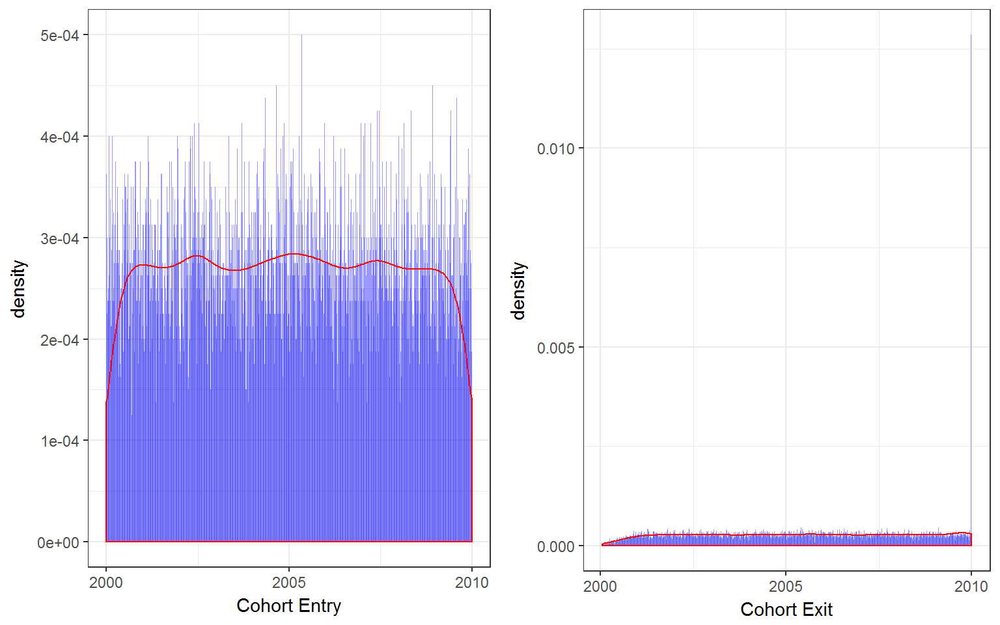

# Creating Longitudinal Datasets From Individual Records


## Introduction  

### Packages to use  
<!--html_preserve--><pre>
 R version 3.3.2 (2016-10-31)
 Platform: x86_64-w64-mingw32/x64 (64-bit)
 Running under: Windows 10 x64 (build 14393)
 
 attached base packages:
 [1] methods   stats     graphics  grDevices utils     datasets  base     
 
 other attached packages:
  [1] gridExtra_2.2.1   lubridate_1.6.0   knitr_1.15.17    
  [4] Scotty_0.0.0.9000 devtools_1.12.0   Hmisc_4.0-2      
  [7] Formula_1.2-1     survival_2.41-2   lattice_0.20-35  
 [10] dplyr_0.5.0       purrr_0.2.2       readr_1.1.0      
 [13] tidyr_0.6.1       tibble_1.2        ggplot2_2.2.1    
 [16] tidyverse_1.1.1  
 </pre>
<!--/html_preserve-->  

I often come across the following issue in my work:  

  Sometimes you are working with a dataset where each row is a nursing home assessment, admission record or some other per person observation. However, perhaps you are more interesting in analyzing group-level changes over time. In order to do this, you need to reshape and summarize these individual records into counts in a "panel" dataset. In this new dataset structure I want each row to be a unique time- group- summary of the data. Some extensions of this include computing incidence (no. events per 1000 persons) and incidence density (no. events per 1000 person-years) measures. I will go through some examples and show how these datasets and measures can be constructed from person or observation unit-level data, assuming you had cohort entry-dates (i.e. admission), event dates (the date of some thing you wish to quantify) and stop-dates (i.e. discharge).  

## Construct dataset  

First I will construct a dataset of admissions that starts counting on 2000/01/01. Each entry will have a random exit up to 1000 days from entry, but censored at 2009/12/31 (because in my hypothetical example this is my study endpoint). Each entry will then have a random group classification (state), and event (0 or 1).    

```r
df <- data.frame(id=1:10000,
                 CohortEntry = sample(seq(as.Date('2000/01/01'), as.Date('2009/12/31'), by='day'), replace=T, 10000))
df <- df %>%
    mutate(CohortExit = CohortEntry+sample(0:365,10000, replace=T)) %>% #CohortExit Date (up to 1000 days from start)
    mutate(State = sample(state.name, 10000, replace=T)) %>% #Random state for each group
    mutate(Event = as.integer(rbernoulli(10000,p=0.1))) #randomly assign 10% to event
  
  df$CohortExit <- as.Date(sapply(df$CohortExit, function(x) min(x,as.Date('2009/12/31'))), origin=origin) #Censor at 'study end'

  #For more complicated procedures below, reassign event=1 to a random date between cohort start and end, and event=0 to NA
  randomDate <- function(TimeIn, TimeOut, Event) {
    RDate <- sample(TimeIn:TimeOut, 1, replace=T)
    RDate <- ifelse(Event==0,NA,RDate)
    return(RDate)
  }
  
  df$EventDate = sapply(df$id, function(x) randomDate(df$CohortEntry[x], df$CohortExit[x], df$Event[x]))
  df$EventDate = as.Date(df$EventDate, origin=origin)
kable(head(df, n=10), align=c('c'))
```


 id    CohortEntry    CohortExit        State         Event    EventDate  
----  -------------  ------------  ----------------  -------  ------------
 1     2003-02-20     2003-07-06       Georgia          0          NA     
 2     2004-06-10     2004-07-13     South Dakota       0          NA     
 3     2000-10-10     2001-06-09       Wyoming          1      2001-04-28 
 4     2006-12-07     2006-12-18       Florida          0          NA     
 5     2001-01-11     2001-10-28       Illinois         1      2001-09-25 
 6     2004-12-22     2005-02-11    North Carolina      0          NA     
 7     2005-11-24     2006-05-22       Maryland         1      2006-01-12 
 8     2008-09-25     2009-03-03       Nebraska         0          NA     
 9     2006-01-08     2006-09-28       Oklahoma         0          NA     
 10    2001-02-15     2001-11-08       Michigan         0          NA     

## Show Data

```r
#Scatter and Fitted Line 
p1 <- ggplot(data=df, aes(x=CohortEntry)) + 
  geom_histogram(aes(y = ..density..), binwidth = 4, fill=I("blue"), alpha=I(0.4)) +
  geom_density(col=2) +
  xlab("Cohort Entry") +
  theme_bw()

p2 <- ggplot(data=df, aes(x=CohortExit)) + 
  geom_histogram(aes(y = ..density..), binwidth = 4, fill=I("blue"), alpha=I(0.4)) +
  geom_density(col=2) +
  xlab("Cohort Exit") +
  theme_bw()
grid.arrange(p1, p2, nrow=1)
```


  A simple, even distribution to work with (cohort exit is even except for censored at study end date).  
  
## Reshape Process  

If you simply seek to count the total no. of records by groups this is simple.  

### Simple group counts  

```r
  dfState <- df %>%
    group_by(State) %>% #Tells dplyr to create grouped object, and then execute following at that unit
      summarise(Records = n()) #count individuals
  
  cat("Counts of Records by State")
```

```
## Counts of Records by State
```

```r
  kable(head(dfState, n=10), align=c('c'))
```

    State       Records 
-------------  ---------
   Alabama        196   
   Alaska         213   
   Arizona        212   
  Arkansas        188   
 California       204   
  Colorado        206   
 Connecticut      229   
  Delaware        212   
   Florida        187   
   Georgia        198   

Also, if you wish to see the quantity of some event, this is easy also:  

#### Simple Event Counts  

```r
  dfState <- df %>%
    group_by(State) %>% #Tells dplyr to create grouped object, and then execute following at that unit
      summarise(Events = sum(Event)) #count no of events
  
  cat("Counts of Events by State")
```

```
## Counts of Events by State
```

```r
  kable(head(dfState, n=10), align=c('c'))
```

    State       Events 
-------------  --------
   Alabama        17   
   Alaska         18   
   Arizona        21   
  Arkansas        28   
 California       23   
  Colorado        17   
 Connecticut      20   
  Delaware        27   
   Florida        21   
   Georgia        20   

If you wish to count records by time, this is still pretty easy, but you have to be more specific. For example, if I want to count the number of Cohort entries by year, this is how:

### Cohort entries by year counts

```r
#First make year var
df <- df %>%
  mutate(EntryYear = year(CohortEntry)) #year function from lubridate
  
#Second group by this var
dfGroup <- df %>% 
  group_by(EntryYear) %>%  
  summarise(Records = n(), Events = sum(Event)) #count individuals
  cat("Counts of Records by Cohort Entry Year")
```

```
## Counts of Records by Cohort Entry Year
```

```r
  kable(head(dfGroup, n=10), align=c('c'))
```


 EntryYear    Records    Events 
-----------  ---------  --------
   2000        1002        97   
   2001        1011        91   
   2002         993        86   
   2003         995       118   
   2004        1004       100   
   2005         993       113   
   2006        1003        89   
   2007        1008       110   
   2008         999        96   
   2009         992       108   

### Cohort prevalence by time

The next step will get a little trickier. Let's say we aren't interested in how many individuals entered/exited the cohort in a given year as above. Rather we want to identify how many total patients are in the cohort during a specified period of time (e.g. year). This is like "point prevalence", in the sense that we are measuring the number of cohort individuals in a given time interval (point prevalence is usually the no. of diseased / total population). So we need to take the "CohortEntry", "CohortExit" date variables and compute how many individuals were in the cohort in year 1, year 2 etc. What makes this tricky is that individuals don't start and stop at the same time and cross multiple time units (years in this case).  

Here is one method where I compute the "prevalent"" cohort, no. events and event rate:  

```r
  #Create New Dataframe by Time Unit
  TimeMin <- min(year(df$CohortEntry)) #lowest time unit observed
  TimeMax <- max(year(df$CohortExit)) #highest time unit observed
  
  #This following sequence step is good, in case a certain year was skipped (i.e. no admits that year)
  dfTime <- TimeMin:TimeMax %>% #Sequence years
    as_tibble() %>%
    mutate(x2 = NA, x3 = NA)
    names(dfTime) <- c("Year", "Residents", "Events")
    
  
  #Write a time-interval program (assuming x is year)
  InCohort <-  function(x, TimeIn, TimeOut) {
    #Note that the following line works because of R vectorization
    count <- if_else(x>=year(TimeIn) & x<=year(TimeOut),1,0) #Test if x is TimeIn<=x<=TimeOut
    InCohortN <- sum(count) #Add up total people
    return(InCohortN) #return
  }
  InEvent <-  function(x, Event, EventDate) {
    #Note that the following line works because of R vectorization
    events <- if_else(Event==1 & x==year(EventDate),1,0) #Added condition of event==1
    InCohortEvents <- sum(events) #Add up total events in that year
    return(InCohortEvents) #return
  }
  dfTime$Residents <- sapply(dfTime$Year, function(x) InCohort(x, df$CohortEntry,df$CohortExit))
  dfTime$Events <- sapply(dfTime$Year, function(x) InEvent(x, df$Event, df$EventDate))
  dfTime$'Event Rate' <- dfTime$Events / dfTime$Residents
  #Calculate events
  #eventnum <- df %?%
  
  cat("No. of individuals in the cohort by year")
```

```
## No. of individuals in the cohort by year
```

```r
  kable(head(dfTime, n=10), align=c('c'), digits=3)
```


 Year    Residents    Events    Event Rate 
------  -----------  --------  ------------
 2000      1002         72        0.072    
 2001      1498         89        0.059    
 2002      1481         98        0.066    
 2003      1486        103        0.069    
 2004      1516        104        0.069    
 2005      1497        115        0.077    
 2006      1495         94        0.063    
 2007      1516         98        0.065    
 2008      1499        104        0.069    
 2009      1496        130        0.087    

We can double-check this worked with the following specific code:  

```r
  #Logic
  # IF 2004 is less than or equal to EntryDate (i.e. they entered before or during 2004)
  # AND 2004 is less than or equal to Exit (i.e. they exited after or during 2004)
  Check <- ifelse(2004>=year(df$CohortEntry) & 2004<=year(df$CohortExit),1,0)
  cat("2004 people :", sum(Check))
```

```
## 2004 people : 1516
```

### Incidence Density  


```r
df <- df %>%
    mutate(TimeDiff = as.integer(CohortExit - CohortEntry)) #timeDiff
```
