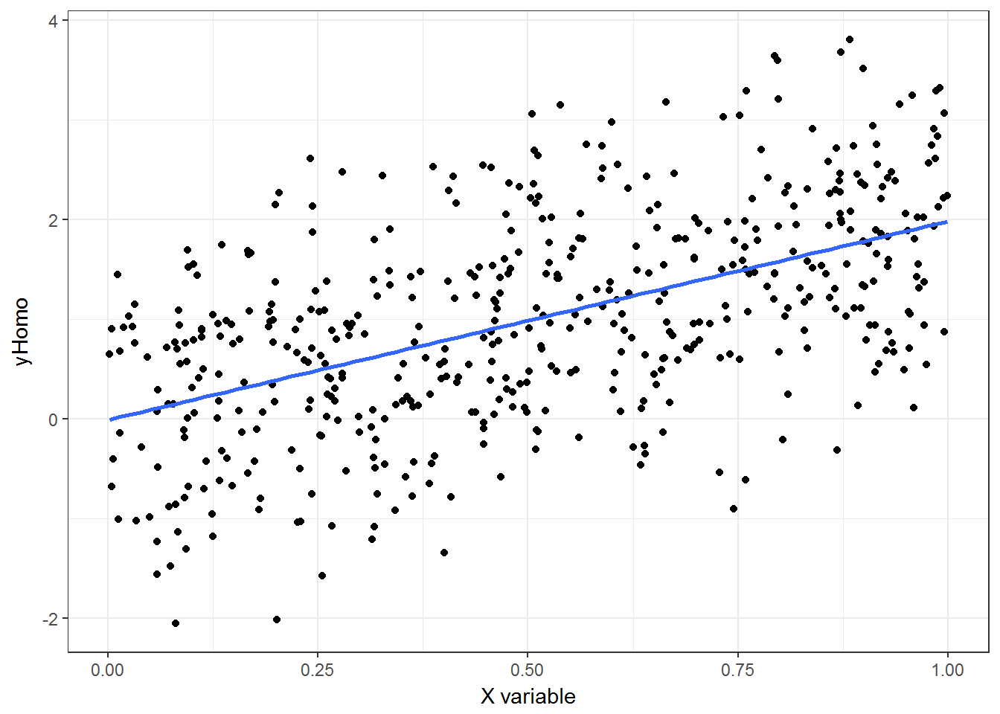
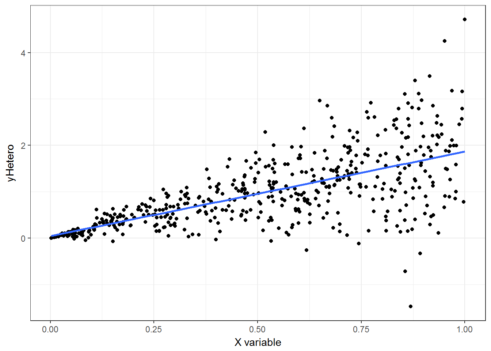

# Heteroskedastic & Cluster Robust Standard Errors  


## Introduction  

In this chapter we are evaluating R's capability to compute different kinds of standard errors. Like with many things, R has extensive flexibility here but can be daunting when you want a quick option. To bring this flexibility down to earth, I lay out the background, provide practical recommendations, user-written commands and benchmark to STATA.  

### Packages to use  
<!--html_preserve--><pre>
 R version 3.3.2 (2016-10-31)
 Platform: x86_64-w64-mingw32/x64 (64-bit)
 Running under: Windows 10 x64 (build 14393)
 
 attached base packages:
 [1] stats     graphics  grDevices utils     datasets  base     
 
 other attached packages:
  [1] knitr_1.15.17     boot_1.3-18       lmtest_0.9-35    
  [4] zoo_1.7-14        sandwich_2.3-4    Scotty_0.0.0.9000
  [7] Hmisc_4.0-2       Formula_1.2-1     survival_2.40-1  
 [10] lattice_0.20-34   dplyr_0.5.0       purrr_0.2.2      
 [13] readr_1.1.0       tidyr_0.6.1       tibble_1.2       
 [16] ggplot2_2.2.1     tidyverse_1.1.1  
 </pre>
<!--/html_preserve-->  

"Scotty" is my own package. "tidyverse" is Wickam et al. general suite of packages/commands to work with R. "Hmisc" is Frank Harrel's miscellaneous commands, many of which are quite useful.  

"sandwich", "lmtest" and "boot" are specifically relevant to this chapter in order to compute various standard errors (SE).  

### Test Data  

The cluster data was obtained from:  
http://www.kellogg.northwestern.edu/faculty/petersen/htm/papers/se/test_data.txt  


### Other References  
## R's calculation of standard errors  

## Heteroskedascity  
*Heteroskedascity* in this context refers to a collection of random variables where a given sub-population will have different variability compared with others. Variability being variance or some other measure of dispersion. In constrast *homoskedascity* is when variance is constant across these subpopulations (Figure 1). 


```r
#Generate Data  
  x <- runif(500)
  yHomo <- 2*x + rnorm(500)
  yHetero <- 2*x + x*rnorm(500) + rnorm(500)
  df <- as.data.frame(cbind(x, yHomo, yHetero))

#Scatter and Fitted Line 
ggplot(data=df, aes(x=x, y=yHomo)) + 
  geom_point() +
  geom_smooth(method='lm', se=F) + 
  xlab("X variable") +
  theme_bw()
```


  
**Figure 1.** Example of homoskedascity. Note how data points appear to be randomly scattered around line of best fit, and that the dispersion *appears* constant across the range of X variable.


```r
#Scatter and Fitted Line 
ggplot(data=df, aes(x=x, y=yHetero)) + 
  geom_point() +
  geom_smooth(method='lm', se=F) + 
  xlab("X variable") +
  theme_bw()
```


  
**Figure 2.** Example of heteroskedascity. See how the dispersion appears greater as X increases.  


@angrist2008mostly  

## Clustering  
@Bertrand04howmuch  

## Stata comparison  

A full discussion of STATA programming can be seen here:   http://www.kellogg.northwestern.edu/faculty/petersen/htm/papers/se/se_programming.htm  
STATA blog:  
http://www.stata.com/support/faqs/statistics/standard-errors-and-vce-cluster-option/  

Briefly: In Stata one can specify a variance-covariance matrix that is heteroskedastic consistent with the *vce(robust)* option in regression models.  


e.g. robust option in STATA    
```{}
regress y x, vce(robust)
```

A Huber-White variance-covariance matrix can also be computed by some group with the **vce(cluster *group*)** option in regression models.  

e.g. cluster option in STATA  
```{}
regress y x, vce(cluster group)
```

See:  
http://www.stata.com/support/faqs/statistics/standard-errors-and-vce-cluster-option/  

## Test data  


```r
url <- "http://www.kellogg.northwestern.edu/faculty/petersen/htm/papers/se/test_data.txt"
df <- as_tibble(read.table(url))
print("Head of test dataframe")
```

```
## [1] "Head of test dataframe"
```

```r
names(df) <- c("group", "year", "x", "y")
head(df)
```

```
## # A tibble: 6 × 4
##   group  year          x          y
##   <int> <int>      <dbl>      <dbl>
## 1     1     1 -1.1139730  2.2515350
## 2     1     2 -0.0808538  1.2423460
## 3     1     3 -0.2376072 -1.4263760
## 4     1     4 -0.1524857 -1.1093940
## 5     1     5 -0.0014262  0.9146864
## 6     1     6 -1.2127370 -1.4246860
```
  This data represent financial information. As a benchmark I will use a widely available set financial data.(@peterson2009) Several online posts compare this data using different specifications and software.
  
The expected results we will recreate are given here:
http://www.kellogg.northwestern.edu/faculty/petersen/htm/papers/se/test_data.htm

## Standard Least Squares with homoskedasctic standard errors  

```r
m1 <- lm(y ~ x, data = df)
coeftest(m1)
```

```
## 
## t test of coefficients:
## 
##             Estimate Std. Error t value Pr(>|t|)    
## (Intercept) 0.029680   0.028359  1.0466   0.2954    
## x           1.034833   0.028583 36.2041   <2e-16 ***
## ---
## Signif. codes:  0 '***' 0.001 '**' 0.01 '*' 0.05 '.' 0.1 ' ' 1
```

These are the results with Table "OLS Coefficients and Standard Errors". R computes the regression coefficients with $( \textbf{X}'\textbf{X})^{-1}\textbf{X}'\textbf{y}$ i.e. the coefficient is a function of X and y.
Variance in general is computed like so:
$Var(X) = E[X − E(X)]^2 = E[(X − E(X)) (X − E(X))]$

In a regression framework you compute standard errors by taking the square root of the diagonal elements of the variance-covariance matrix. 

Equation 1. Covariance matrix of the error term $u$
$E[{uu}'|\textbf{X}] = \mathbf{\Sigma_{u}}$

Equation 2.  
$\mathbf{\Sigma_{u}} = \sigma^2 I_{N}$

Equation 3. Expectation of the variance of $\beta$ conditional on X.  
$\textrm{Var}[\hat{\mathbf{\beta}}|\textbf{X}] = (\textbf{X}'\textbf{X})^{-1}(\textbf{X}' \mathbf{\Sigma_{u}} \textbf{X}) (\textbf{X}'\textbf{X})^{-1}$

Under the assumption of independent and identically distributed errors and homoskedascity, Equation 3 is simplified to equation 4 (transpose matrix, using diagonal elements).  

Equation 4. iid assumed
$\textrm{Var}[\hat{\mathbf{\beta}}|\textbf{X}] = \sigma_{u}^{2}(\textbf{X}'\textbf{X})^{-1}$

Assuming $\sigma_u^2$ is fixed but unknown, and equation to esimate $s^2$ can be used:

Equation 5. standard error

$s^2 = \frac{\sum_{i=1}^n e_i^2}{n-k}$

Where $e$ squared residuals, $n$ is the sample size, and $k$ are the number of regressors. 

The Standard errors above can be replicated manually like so:

```r
# get X matrix/predictors
X <- model.matrix(m1)
# number of obs
n <- dim(X)[1]
# n of predictors
k <- dim(X)[2]
# calculate stan errs as in the above
# sq root of diag elements in vcov
se <- sqrt(diag(solve(crossprod(X)) * as.numeric(crossprod(resid(m1))/(n-k))))
se
```

```
## (Intercept)           x 
##  0.02835932  0.02858329
```

## Heteroskedastic consistent errors in R  


## Cluster robust errors in R  

## Block bootstrapping  

An alternative to computing special variance-covariance matrices is non-parametric  "block" bootstrapping. To do this, you perform a bootstrapping procedure where you sample the group or "block" instead of unit observation. This has been shown to be about as consistent and unbiased as the above sandwich estimators, and may be advantgeous when the number of clusters is small.@Bertrand04howmuch  

### Bootstrap Program  


```r
Boot.ATE <- function (model, treat, R = 250, block = "", df) 
{
  require(boot)
  require(dplyr)
  family <- model$family
  if (block == "") {
    boot.mod <- function(x, i, model, treat) {
      samp.df <- x[i, ]
      samp.glm <- try(glm(model, data = samp.df, family = family))
      if (inherits(samp.glm, "try-error")) {
        coef <- NA
        ate <- NA
        rr <- NA
        c(coef, ate, rr)
      }
      else {
        df2 <- samp.df
        df2[, paste(treat)] = 1
        pred1. <- predict.glm(samp.glm, newdata = df2, 
          type = "response")
        df2[, paste(treat)] = 0
        pred0. <- predict.glm(samp.glm, newdata = df2, 
          type = "response")
        coef <- samp.glm$coefficients[paste0(treat)]
        ate <- mean(pred1.) - mean(pred0.)
        rr <- mean(pred1.)/mean(pred0.)
        c(coef, ate, rr)
      }
    }
    boot.m <- boot(data = df, statistic = boot.mod, R = R, 
      model = model, treat = treat)
  }
  else {
    Groups = unique(df[, paste(block)])
    boot.mod <- function(x, i, model, treat, df, block, 
      iter = 0) {
      block.df <- data.frame(group = x[i])
      names(block.df) = block
      samp.df <- left_join(block.df, df, by = block)
      samp.glm <- try(glm(model, data = samp.df, family = family))
      if (inherits(samp.glm, "try-error")) {
        coef <- NA
        ate <- NA
        rr <- NA
        c(coef, ate, rr)
      }
      else {
        df2 <- samp.df
        df2[, paste(treat)] = 1
        pred1. <- predict.glm(samp.glm, newdata = df2, 
          type = "response")
        df2[, paste(treat)] = 0
        pred0. <- predict.glm(samp.glm, newdata = df2, 
          type = "response")
        coef <- samp.glm$coefficients[paste0(treat)]
        ate <- mean(pred1.) - mean(pred0.)
        rr <- mean(pred1.)/mean(pred0.)
        c(coef, ate, rr)
      }
    }
    boot.m <- boot(data = Groups, statistic = boot.mod, 
      R = R, model = model, treat = treat, df = df, block = block)
  }
  m1.confint <- c(model$coefficients[paste0(treat)], confint(model, 
    treat, level = 0.95))
  coeff = boot.ci(boot.m, index = 1, type = "perc")
  coeff = c(median(boot.m$t[, 1]), coeff$percent[, 4], coeff$percent[, 
    5])
  names(coeff) <- c("Coeff.", "2.5%", "97.5%")
  ate = boot.ci(boot.m, index = 2, type = "perc")
  ate = c(median(boot.m$t[, 2]), ate$percent[, 4], ate$percent[, 
    5])
  names(ate) <- c("ATE", "2.5%", "97.5%")
  rr = boot.ci(boot.m, index = 3, type = "perc")
  rr = c(median(boot.m$t[, 3]), rr$percent[, 4], rr$percent[, 
    5])
  names(rr) <- c("Rr", "2.5%", "97.5%")
  boot.iter = boot.m$t
  res = list(level = 0.95, model_ci = m1.confint, coeff = coeff, 
    ate = ate, rr = rr, boots = boot.iter)
  return(res)
}
```

## Acknowledgements  
This chapter is heavily adapted from several StackExchange and other blog posts.
See:  
http://www.richard-bluhm.com/clustered-ses-in-r-and-stata-2/  
http://www.kellogg.northwestern.edu/faculty/petersen/htm/papers/standarderror_extra_tables.pdf  
https://sites.google.com/site/waynelinchang/r-code  
http://www.kellogg.northwestern.edu/faculty/petersen/htm/papers/se/test_data.htm  
https://thetarzan.wordpress.com/2011/05/28/heteroskedasticity-robust-and-clustered-standard-errors-in-r/  

## Bibliography  
@R-base  
