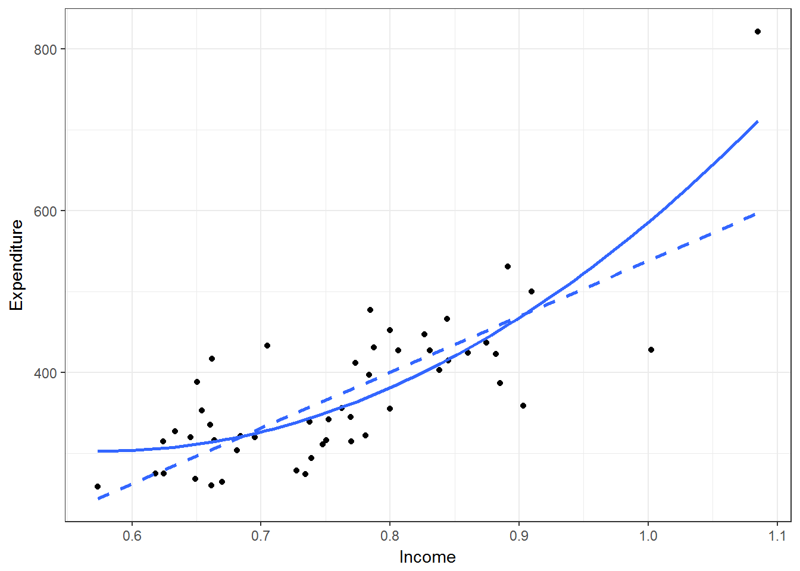

# Heteroskedastic & Cluster Robust Standard Errors  


## Introduction  
In this chapter I evaluate R's capability to compute different kinds of standard errors. Like with many things, R has extensive flexibility here but can be daunting when you want a quick option. To bring this down to earth, I lay out the background, provide practical recommendations, user-written commands and benchmark to STATA.  

### Packages to use  
<!--html_preserve--><pre>
 R version 3.3.2 (2016-10-31)
 Platform: x86_64-w64-mingw32/x64 (64-bit)
 Running under: Windows 10 x64 (build 14393)
 
 attached base packages:
 [1] stats     graphics  grDevices utils     datasets  base     
 
 other attached packages:
  [1] knitr_1.15.17     boot_1.3-18       lmtest_0.9-35    
  [4] zoo_1.7-14        sandwich_2.3-4    Scotty_0.0.0.9000
  [7] devtools_1.12.0   Hmisc_4.0-2       Formula_1.2-1    
 [10] survival_2.41-3   lattice_0.20-34   dplyr_0.5.0      
 [13] purrr_0.2.2       readr_1.1.0       tidyr_0.6.1      
 [16] tibble_1.3.0      ggplot2_2.2.1     tidyverse_1.1.1  
 </pre>
<!--/html_preserve-->  

"Scotty" is my own package. "tidyverse" is Wickam et al. general suite of packages/commands to work with R. "Hmisc" is Frank Harrel's miscellaneous commands, many of which are quite useful. "sandwich", "lmtest" and "boot" are specifically relevant to this chapter in order to compute various standard errors (SE).  

## Test data  

 To test and demonstrate code and assumptions are correct. I utilize the "PublicSchools" dataset in the "sandwich" package. This dataset is well-described in peer-reviewed research, and standard text books (Table 14.1 in Green [1993]).[@CIS-6161, @Zeileis2004, @Zeileis2006, @Cribari2004] The data comes originally from a 1979 report on per capita public school expenditures and per capita income by state from the U.S. Dept. of Commerce.  


```r
## Load public schools data, omit NA in Wisconsin, scale income and make squared Income term:
data(PublicSchools)
df <- as_tibble(PublicSchools %>% na.omit() %>% mutate(Income = Income*1e-04)) %>% mutate(`Income^2` = Income^2)
kable(head(df), align=c('c'), digits = 2)
```


 Expenditure    Income    Income^2 
-------------  --------  ----------
     275         0.62       0.39   
     821         1.09       1.18   
     339         0.74       0.54   
     275         0.62       0.38   
     387         0.88       0.78   
     452         0.80       0.64   


```r
se_results <- as_tibble(matrix(nrow=8,ncol=6))
names(se_results) <- c("Program","VCE", "Income (Beta)","Income (SE)","Income^2 (Beta)","Income^2 (SE)")

method <- c("manual","lm","manual","HC0", "HC1","HC2","HC3","HC4")

type <- c("iid", "iid", "White (dfc)", "White (orig.)", "White (STATA)", "White", "White", "Cribari 2004")

for (i in 1:nrow(se_results)) {
  se_results[i,1] <- method[i]
  se_results[i,2] <- type[i]
}
```

## Linear Regression Model 

First, I start with the classical ordinary least squares framework.
$$y_i = X_i\beta + u_{i} \quad \textrm{where} \quad i = 1,..,n$$

Where $y$ is a dependent variable, $X$ is a vector of regressors (i.e. independent variables) with $k$-dimensions, $\beta$ is a vector of the coefficients for $X$, and $u$ is the residual error term. In matrix notation often simply as: $y= X\beta+u$.  

Under normal assumptions, the mean of $u_i$ (that is the residual of a given observation $i$) should be zero and possess a constant variance across all subsets of $i$. The second assumption is my focus here, which is often incorrect in empirical research. 

## Estimation of regression parameters and variance 

Typically in empirical research you are interested in estimating some or all parameter coefficients, and a measure of variance or precision on that parameter. Most researchers will ultimately make a statement along the lines of "A 1-unit change in $x$ produces a $\beta$-unit change in $y$, and a null hypothesis of $\beta$=0 is rejected with 95% confidence".

In our example, assume we want to model per capita expenditures regressed on income. 

First, I demonstrate how to estimate your parameter coefficient, $\beta_1$ the coefficient on income and the square root of the variance, $\sigma$.  

### Manually computed beta parameters  
R basically computes the regression coefficients with the standard $(\textbf{X}'\textbf{X})^{-1}\textbf{X}'\textbf{y}$  

I can do this manually like so:  


```r
Y = as.matrix(df$Expenditure)
X = as.matrix(cbind(1,df$Income, df$`Income^2`)) #Add one for intercept
beta = solve(t(X) %*% X) %*% (t(X) %*% Y) 
rownames(beta) <- c("Int","Income",'Income^2') 
colnames(beta) <- c("Beta")
se_results[1,3] <- beta[2,1]
se_results[1,5] <- beta[3,1]
kable(se_results, align=c('c'), digits=3)  
```


 Program         VCE         Income (Beta)    Income (SE)    Income^2 (Beta)    Income^2 (SE) 
---------  ---------------  ---------------  -------------  -----------------  ---------------
 manual          iid           -1834.203          NA            1587.042             NA       
   lm            iid              NA              NA               NA                NA       
 manual      White (dfc)          NA              NA               NA                NA       
   HC0      White (orig.)         NA              NA               NA                NA       
   HC1      White (STATA)         NA              NA               NA                NA       
   HC2          White             NA              NA               NA                NA       
   HC3          White             NA              NA               NA                NA       
   HC4      Cribari 2004          NA              NA               NA                NA       

### Manually computed standard errors  

In a regression framework you compute standard errors by taking the square root of the diagonal elements of the variance-covariance matrix. As defined above, consider $u$ is normally distributied with mean=0, and standard deviation, $\sigma^2I$. Where $\sigma^2$ is the variance. 

First, define the expectation of the variance of $\beta$ conditional on X.  
$$\textrm{Var}[\hat{\mathbf{\beta}}|\textbf{X}] = (\textbf{X}'\textbf{X})^{-1}(\textbf{X}' \mathbf{\sigma^2_{u}}\mathbf{I}\textbf{X}) (\textbf{X}'\textbf{X})^{-1}$$

If you assume that $u$ is indepedent (i.e. orthogonal) to $\beta$, and identically distributed across subpopulations of $\beta$. The variance of a random vector X and non-random matrix = matrix * Var(X) * matrix', can be expressed as:
$$\textrm{Var}[\hat{\mathbf{\beta}}|\textbf{X}] = \mathbf{\sigma^2_{u}}(\textbf{X}'\textbf{X})^{-1}$$


$$E[{uu}'|\textbf{X}] = \mathbf{\Sigma_{u}}$$


Assuming $\sigma_u^2$ is fixed but unknown, a given random sample's variance, $s^2$, can be estimated:

Equation 5. Standard Error

$$s^2 = \frac{\sum_{i=1}^n e_i^2}{n-k}$$

Where $e$ are the squared residuals, $n$ is the sample size, and $k$ are the number of regressors. 

With this information the standard errors above can be replicated manually like so:  


```r
Y = as.matrix(df$Expenditure) #Dependent variable
X = as.matrix(cbind(1,df$Income, df$`Income^2`)) #Design matrix, add one for intercept
beta = solve(t(X) %*% X) %*% (t(X) %*% Y) #Solve for beta as above
n <- dim(X)[1] # number of obs
k <- dim(X)[2] # n of predictors

# calculate stan errs as eq in the above
SigmaSq <- sum((Y - X%*%beta)^2)/(n-k)  # (sum residuals)^2 / (degree of freedom correction) i.e. estimate of sigma-squared
vcovMat <- SigmaSq*chol2inv(chol(t(X)%*%X)) # variance covariance matrix
StdErr <- sqrt(diag(vcovMat)) #sq root of diagonal
se_results[1,4] <- StdErr[2]
se_results[1,6] <- StdErr[3]
kable(se_results, align=c('c'), digits=3)  
```


 Program         VCE         Income (Beta)    Income (SE)    Income^2 (Beta)    Income^2 (SE) 
---------  ---------------  ---------------  -------------  -----------------  ---------------
 manual          iid           -1834.203        828.985         1587.042           519.077    
   lm            iid              NA              NA               NA                NA       
 manual      White (dfc)          NA              NA               NA                NA       
   HC0      White (orig.)         NA              NA               NA                NA       
   HC1      White (STATA)         NA              NA               NA                NA       
   HC2          White             NA              NA               NA                NA       
   HC3          White             NA              NA               NA                NA       
   HC4      Cribari 2004          NA              NA               NA                NA       

### R lm function

To confirm the above we can compute the same with the the lm function

```r
  m1 <- lm(Expenditure ~ Income + `Income^2`, data = df)
  se_results[2,3] <- coeftest(m1)[2,1]
  se_results[2,4] <- coeftest(m1)[2,2]
  se_results[2,5] <- coeftest(m1)[3,1]
  se_results[2,6] <- coeftest(m1)[3,2]
  kable(se_results, align=c('c'), digits=3)  
```


 Program         VCE         Income (Beta)    Income (SE)    Income^2 (Beta)    Income^2 (SE) 
---------  ---------------  ---------------  -------------  -----------------  ---------------
 manual          iid           -1834.203        828.985         1587.042           519.077    
   lm            iid           -1834.203        828.985         1587.042           519.077    
 manual      White (dfc)          NA              NA               NA                NA       
   HC0      White (orig.)         NA              NA               NA                NA       
   HC1      White (STATA)         NA              NA               NA                NA       
   HC2          White             NA              NA               NA                NA       
   HC3          White             NA              NA               NA                NA       
   HC4      Cribari 2004          NA              NA               NA                NA       

The estimates are identical. However the critical assumption here of $u$ being "iid", can often be wrong in the "real-world". In the following, I broadly define these concepts.

## Heteroskedascity  
*Heteroskedascity* in this context refers to a random variable where a given subset of a sample will have different variability compared with others. Variability being variance or some other measure of dispersion. In constrast *homoskedascity* is when variance is constant across these subpopulations (Figure 1). 


```r
#Generate Data  
  x <- runif(500)
  yHomo <- 2*x + rnorm(500)
  yHetero <- 2*x + x*rnorm(500)
  df2 <- as.data.frame(cbind(x, yHomo, yHetero))

#Scatter and Fitted Line 
ggplot(data=df2, aes(x=x, y=yHomo)) + 
  geom_point() +
  geom_smooth(method='lm', se=F) + 
  xlab("X variable") +
  theme_bw()
```


  
**Figure 1.** Example of homoskedascity. Note how data points appear to be randomly scattered around line of best fit, and that the dispersion *appears* of the points constant across the range of X variable.


```r
#Scatter and Fitted Line 
ggplot(data=df2, aes(x=x, y=yHetero)) + 
  geom_point() +
  geom_smooth(method='lm', se=F) + 
  xlab("X variable") +
  theme_bw()
```


**Figure 2.** Example of heteroskedascity. See how the dispersion of the points appears greater as X increases.  

### Heteroskedascity in income data


```r
#Scatter and Fitted Line 
p <- ggplot(data=df, aes(x=Income, y=Expenditure)) + 
  geom_point() +
  geom_smooth(method='lm', formula=y ~ x + poly(x,2), se=F) + 
  geom_smooth(method='lm', linetype=2, se=F) +
  xlab("Income") +
  theme_bw()
suppressWarnings(print(p))
```




In our "real-world" small sample of data a visual representation of data can be challenging to draw conclusions from. We see there is an outlier ("Alaska"). However, it is difficult to judge overall dispersion with either a squared term [solid line] or a linear term [dashed line]. 

## "White" heteroskedastic consistent errors 

  In the setting of heteroskedascity, the parameters themselves are consistent but inefficient and the variance-covariance matrix is inconsistent (i.e. biased).[@white1980] The assumption of the residuals $u$ being *identically* distributed does not hold, and the diagonal matrix is invalid. However, an alternative variance-covariance matrix can be computed which is heteroskedastic consistent.[@white1980]  

  With the "robust" approach proposed by White et al., you assume  the variance of the residual is estimated as a diagonal matrix of each squared residual (vs. average above with $s^2$). Each j-th row-column element is $\hat{u}_{j}^{2}$ in the diagonal terms of ${\Sigma_{u}}$. 

The full equation is:  

### Manual estimator  

```r
u <- matrix(resid(m1)) # residuals from model object
meat1 <- t(X) %*% diag(diag(crossprod(t(u)))) %*% X # Sigma is a diagonal with u^2 as elements
dfc <- n/(n-k) # degrees of freedom adjust  
se <- sqrt(dfc*diag(solve(crossprod(X)) %*% meat1 %*% solve(crossprod(X))))
se_results[3,3] <- coeftest(m1)[2,1]
se_results[3,5] <- coeftest(m1)[3,1]
se_results[3,4] <- se[2]
se_results[3,6] <- se[3]
kable(se_results, align=c('c'), digits=3)  
```


 Program         VCE         Income (Beta)    Income (SE)    Income^2 (Beta)    Income^2 (SE) 
---------  ---------------  ---------------  -------------  -----------------  ---------------
 manual          iid           -1834.203        828.985         1587.042           519.077    
   lm            iid           -1834.203        828.985         1587.042           519.077    
 manual      White (dfc)       -1834.203       1282.101         1587.042           856.072    
   HC0      White (orig.)         NA              NA               NA                NA       
   HC1      White (STATA)         NA              NA               NA                NA       
   HC2          White             NA              NA               NA                NA       
   HC3          White             NA              NA               NA                NA       
   HC4      Cribari 2004          NA              NA               NA                NA       

  You will find these "White" or robust standard errors are consistent with the second Peterson table.[@peterson2009]  They are also consistent with STATA's *robust* option. It is not technically the same as the White paper because STATA does a degree of freedom adjustment for small sample size.  
  
### R standard function   

Using the already written commands you can specify "White" standard errors with the vcovHC function in the sandwich package.[@Zeileis2006] You can report correct standard errors like below with vcovHC option in function coeftest.  

vcovHC has several types available. The general formula for the var-cov matrix is: $(X'X)^{-1} X' Omega X (X'X)^{-1}$.  

The specification of $Omega$ is determined by the `type=` option.  

`type="cons"` $\omega_i = \sigma^2$ Constant variance  
`type=HC0`    $\omega_i = \mu^2_i$ the White variance-covariance matrix   
`type=HC1`    $\omega_i = \frac{n}{n-k}\mu^2_i$ Small sample correction (STATA).  
`type=HC2`    $\omega_i = \frac{\mu^2_i}{1-h_i}$  
`type=HC3`    $\omega_i = \frac{\mu^2_i}{(1-h_i)^{2}}$  
`type=HC4`    $\omega_i = \frac{\mu^2_i}{(1-h_i)^{\delta_i}}$  

Where $h_i = H_{ii}$ are the diagonal elements of the hat matrix and $\delta_i = min({4 }, {h_i}{h¯})$. The documentation for the sandwich package recommends HC4 based on recent literature.[@Cribari2004]  

The general variance-covariance specification is sometimes called a "Sandwich" estimator because $(X'X)^{-1}$ sandwiches the "meat" $\Omega$.


 Program         VCE         Income (Beta)    Income (SE)    Income^2 (Beta)    Income^2 (SE) 
---------  ---------------  ---------------  -------------  -----------------  ---------------
 manual          iid           -1834.203        828.985         1587.042           519.077    
   lm            iid           -1834.203        828.985         1587.042           519.077    
 manual      White (dfc)       -1834.203       1282.101         1587.042           856.072    
   HC0      White (orig.)      -1834.203       1243.043         1587.042           829.993    
   HC1      White (STATA)      -1834.203       1282.101         1587.042           856.072    
   HC2          White          -1834.203       1866.406         1587.042          1250.147    
   HC3          White          -1834.203       2975.411         1587.042          1995.242    
   HC4      Cribari 2004       -1834.203       8183.191         1587.042          5488.929    

Alternative to the `coeftest` function you can also directly modify the standard errors in the regression summary object.  


```r
s <- summary(m1)
s$coefficients[, 2] <- sqrt(diag(vcovHC(m1, type="HC1")))
s
```

```
## 
## Call:
## lm(formula = Expenditure ~ Income + `Income^2`, data = df)
## 
## Residuals:
##      Min       1Q   Median       3Q      Max 
## -160.709  -36.896   -4.551   37.290  109.729 
## 
## Coefficients:
##             Estimate Std. Error t value Pr(>|t|)   
## (Intercept)    832.9      475.4   2.545  0.01428 * 
## Income       -1834.2     1282.1  -2.213  0.03182 * 
## `Income^2`    1587.0      856.1   3.057  0.00368 **
## ---
## Signif. codes:  0 '***' 0.001 '**' 0.01 '*' 0.05 '.' 0.1 ' ' 1
## 
## Residual standard error: 56.68 on 47 degrees of freedom
## Multiple R-squared:  0.6553,	Adjusted R-squared:  0.6407 
## F-statistic: 44.68 on 2 and 47 DF,  p-value: 1.345e-11
```


## Acknowledgements  
This chapter is heavily adapted from several StackExchange and other blog posts.
See:  
http://www.richard-bluhm.com/clustered-ses-in-r-and-stata-2/  
https://sites.google.com/site/waynelinchang/r-code  
https://thetarzan.wordpress.com/2011/05/28/heteroskedasticity-robust-and-clustered-standard-errors-in-r/  

## Bibliography  
 
